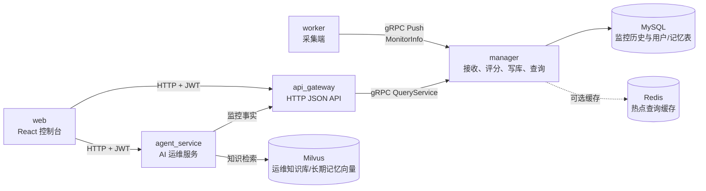

# monitor-system

`monitor-system` 是一个面向 Linux 服务器的分布式性能监控系统。系统采用 worker 主动 Push 的方式采集主机、网络、磁盘、MySQL、Redis 等指标，由 manager 统一写入 MySQL 并提供 gRPC 查询能力；api_gateway 将查询能力转换为 HTTP JSON API；web 提供可视化控制台；agent_service 基于监控事实和内部知识库提供 AI 运维分析。

## 技术栈

| 层级            | 技术                                                        |
| --------------- | ----------------------------------------------------------- |
| 采集与管理      | C++17、gRPC、Protocol Buffers、Linux 内核模块、eBPF、procfs |
| HTTP 与 AI 服务 | Go、Gin、CloudWeGo Eino                                     |
| 前端            | React、TypeScript、Vite、ECharts                            |
| 存储与检索      | MySQL、Redis、Milvus                                        |
| 构建与部署      | CMake、Conan、Makefile、Docker Compose                      |

## 总体架构



## 项目目录

```text
monitor-system/
├── agent_service/          # Go AI 运维服务，详见 agent_service/README.md
├── api_gateway/            # Go HTTP API 网关，详见 api_gateway/README.md
├── configs/                # 统一环境变量示例与说明，详见 configs/README.md
├── deploy/                 # Docker Compose 部署编排
├── manager/                # C++ 管理端，详见 manager/README.md
├── proto/                  # gRPC/Protobuf 契约
├── sql table/              # MySQL 建表脚本与表说明，详见 sql table/README.md
├── tests/                  # 模拟 worker 与本地集成测试，详见 tests/README.md
├── web/                    # React 前端控制台，详见 web/README.md
├── worker/                 # C++ 采集端，详见 worker/README.md
├── build_debug.py          # Debug 构建脚本
└── CMakeLists.txt          # C++ 顶层构建入口
```

## 模块文档

- [worker](./worker/README.md)：采集端启动、采集器、eBPF、内核模块和 MySQL/Redis 实例采集。
- [manager](./manager/README.md)：接收链路、评分模型、写库、Redis 缓存和 gRPC 查询服务。
- [api_gateway](./api_gateway/README.md)：HTTP API、JWT 鉴权、用户管理和 Manager gRPC client。
- [agent_service](./agent_service/README.md)：AI 对话、RAG、AI Ops、长期记忆和模型配置。
- [web](./web/README.md)：前端页面、环境变量、代理规则和构建部署。
- [configs](./configs/README.md)：统一配置文件和环境变量。
- [tests](./tests/README.md)：模拟推送、压测和本地验证。
- [MySQL 表结构](./sql%20table/README.md)：所有 MySQL 脚本和表说明。

## 环境要求

- Linux，推荐 Ubuntu 20.04+；eBPF 建议内核 5.4+。
- GCC 9+ 或 Clang 10+，支持 C++17。
- CMake 3.10+、Conan 1.40+、Python 3.6+。
- Go：`api_gateway` 建议 1.22+，`agent_service` 建议 1.24+。
- Node.js 24+ 和 npm，用于前端构建。
- MySQL 8.0+，用于监控历史、用户表和 agent_service 记忆表。
- Redis 6.0+，用于 manager 查询缓存，也可作为被监控实例。
- Milvus 2.5+，用于 agent_service 运维知识库和长期记忆向量。
- `protoc`、`protoc-gen-go`、`protoc-gen-go-grpc`，用于 Go gRPC 代码生成。
- eBPF 构建需要 `bpftool`、clang、libbpf、elfutils、ZLIB 和系统 BTF/vmlinux 头文件。

## 快速开始

### 1. 启动基础服务

从项目根目录启动 MySQL、Redis、Milvus、api_gateway、agent_service 和 web：

```bash
docker compose --env-file configs/app.env -f deploy/docker-compose.yml up -d
```

MySQL 首次初始化时会执行 [sql table](./sql%20table/) 目录下的建表脚本。`manager` 和 `worker` 默认作为宿主机进程运行。

### 2. 加载统一配置

```bash
set -a
source configs/app.env
set +a
```

首次使用前建议从示例文件检查并调整密钥、管理员账号和外部服务地址：

```text
configs/app.example.env
configs/manager.example.env
web/.env.example
```

### 3. 构建 C++ 组件

```bash
python3 ./build_debug.py
```

也可以按需构建：

```bash
cmake --build build/Debug --target manager
cmake --build build/Debug --target worker
```

### 4. 启动 manager

```bash
./build/Debug/manager/manager 0.0.0.0:50051
```

### 5. 启动 worker

在被监控机器上运行：

```bash
sudo ./build/Debug/worker/worker <manager_ip>:50051 10
```

如果只想验证 manager 接收和写库链路，可以使用模拟 worker：

```bash
./build/Debug/tests/simulated_workers_push localhost:50051 5 2 20
```

### 6. 访问前端与 API

- 前端控制台：`http://127.0.0.1:3000`
- API Gateway：`http://127.0.0.1:8080`
- Agent Service：`http://127.0.0.1:6872/api/agent`
- Milvus Attu：`http://127.0.0.1:8000`

登录账号由 `configs/app.env` 中的 `ADMIN_USERNAME` 和 `ADMIN_PASSWORD` 引导创建。更多接口、配置和排障说明请查看对应模块 README。

## 常用验证命令

```bash
cmake --build build/Debug --target monitor_proto
cmake --build build/Debug --target manager
cmake --build build/Debug --target worker
make -C api_gateway proto
(cd api_gateway && go test ./...)
(cd agent_service && go test ./...)
npm --prefix web run build
```
